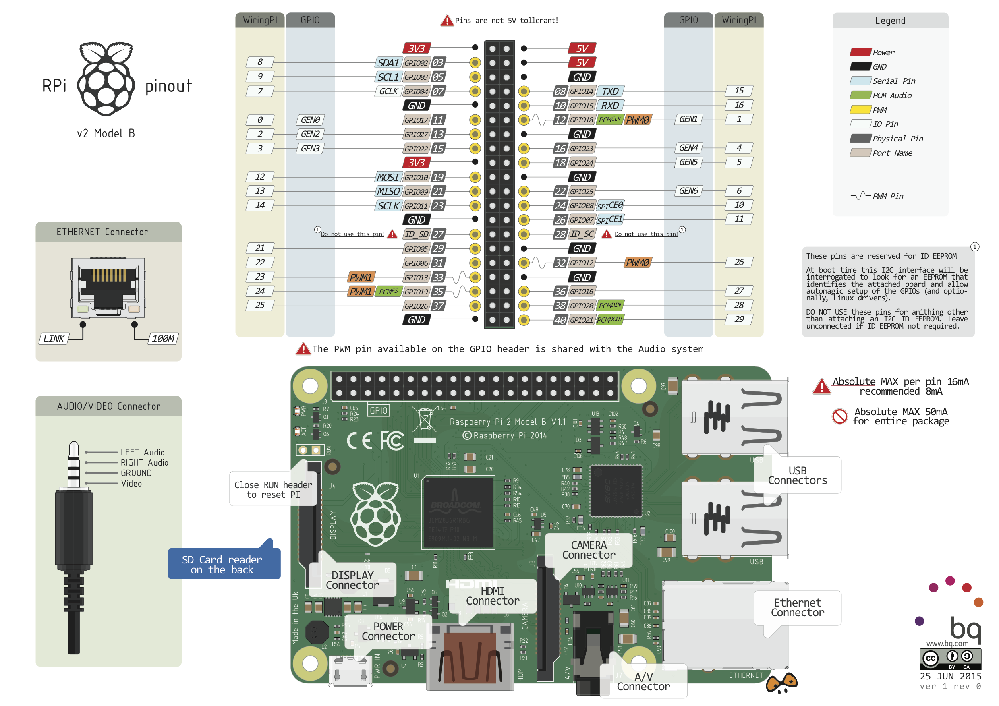

# 树莓派3+WiFi+SSH 安装 (RASPBIAN JESSIE LITE)


### 认识树莓派

本文将带大家用完成树莓派3的无显示器和键鼠的安装，安装系统为RASPBIAN JESSIE LITE，在此之前先了解下树莓派  
树莓派是一个只有信用卡大小的卡片式电脑，基于ARM架构，采用Linux作为其操作系统


#### 树莓派版本参数

#### 树莓派硬件图


### 安装准备

* 硬件
    * 树莓派3B ( 带电源 )
    * Micro SD卡 ( TF卡 )
    * 读卡器 ( 用于系统烧录 )
    * 无线路由器 ( 带有线口 )
    * 网线
    * 电脑 ( 本文使用macbook )
* 软件
    * SD Formatter ( [Mac](https://www.sdcard.org/chs/downloads/formatter_4/eula_mac/index.html) | [Windows](https://www.sdcard.org/chs/downloads/formatter_4/eula_Windows/index.html) )
    * [ApplePi Baker](https://www.tweaking4all.com/software/macosx-software/macosx-apple-pi-baker/) ( windows可用 [Win32writer](https://sourceforge.net/projects/win32diskimager/) )
    * [RASPBIAN JESSIE LITE](https://www.raspberrypi.org/downloads/raspbian/) 系统镜像
    * ssh ( windows可用 [Putty](http://www.putty.org/) )
    * BetterZip ( Mac上的解压工具 )

### 开始安装

1. 软件安装，无脑安装以上软件即可
2. 系统镜像下载后是一个压缩文件，解压后是扩展名为.img的镜像文件  
例如：2017-09-07-raspbian-stretch-lite.img
3. 使用 SD Formatter 格式化 TF卡

4. 使用ApplePi Baker 烧录系统镜像 ( Win32writer操作类似 )

5. 打开终端Terminal( windows打开命令行CMD )  
在SD卡根目录创建一个ssh文件，用来开启树莓派ssh服务
- Mac
```Bash
touch /Volumes/G/ssh
```
- Windows
```Bash
echo>G:\ssh
```
6. 把TF卡插入树莓派，用网线连接树莓派和路由器，接通电源开机  
等待一分钟左右，即可完成系统安装 ( 有显示器的可以连接查看进度 )
7. 打开终端Terminal( windows打开命令行CMD )  
先ping下raspberrypi.local,如果有输出ip，说明系统安装成功 ( ping不通可以试试 raspberrypi )  
如果无法ping到 可以查看路由器管理界面看是否有 raspberrypi 的设备接入

获取到ip 就可以用ssh登录了 ( 默认用户为pi 密码为 raspberry )  


```Bash
# 获取树莓派IP
ping raspberrypi
ping raspberrypi.local
ssh pi@raspberrypi.local
```

远程ssh登录成功！可以欢呼了  
可用下面命令进入树莓派系统配置
```Bash
sudo raspi-config
```

### 连接无线网络
有线连接还是过于累赘，现在一般家庭都有无线路由器，树莓派3B又自带wifi模块，为什么不直接连接wifi呢？  
说干就干！

1. 修改 /etc/network/interfaces

```Bash
 sudo vim /etc/network/interfaces
```
- 执行后 添加以下内容到文件中 ( 注意看是否有重复部分 )
```Bash
# 自动运行 ( 如不使用有线可以删除eth0 )
auto lo eth0 wlan0 wlan1

iface lo inet loopback
iface eth0 inet dhcp

allow-hotplug wlan0 wlan1

iface wlan0 inet dhcp
wpa-conf /etc/wpa_supplicant/wpa_supplicant.conf

iface wlan1 inet manual
pre-up which owifi
up owifi start
down owifi stop
```

2. 修改 /etc/wpa_supplicant/wpa_supplicant.conf

```Bash
 sudo vim /etc/wpa_supplicant/wpa_supplicant.conf 
```
- 执行后 添加你的WIFI配置 ( priority为优先级，数值越大优先级越高 )
```Bash
 # 最常用的配置。WPA-PSK 加密方式。
 network={
 ssid="WiFi-name1"
 psk="WiFi-password1"
 priority=5
 }
 
 network={
 ssid="WiFi-name2"
 psk="WiFi-password2"
 priority=4
 }
```
不确定你的wifi ssid可以用以下命令搜索wifi

```Bash
 # 监测网卡
 iwconfig
 # 如果输出信息 没有wlan0 执行下面语句安装wifi依赖工具
 sudo apt-get install wireless-tools wpasupplicant firmware-realtek
 # 搜索附近所有可连接的Wifi
 iwlist wlan0 scan | grep SSID
 # 尝试连接 wifi
 sudo ifup wlan0
```
如果出现了wlan0，那说明网卡已经正常工作了。

### 其他
- 更新服务器源 ( 解决apt-get过慢或者失败 )
```Bash
sudo cp /etc/apt/sources.list /etc/apt/sources.list.bak  #备份为 sources.list.bak
sudo nano /etc/apt/sources.list                  #编辑sources.list  文件
```
用#注释之前源地址，添加阿里镜像源
```Bash
deb http://mirrors.aliyun.com/raspbian/raspbian/ wheezy main non-free contrib
deb-src http://mirrors.aliyun.com/raspbian/raspbian/ wheezy main non-free contrib
```
```Bash
sudo apt-get update        #更新系统软件
sudo apt-get upgrade       #更新已安装的包
```